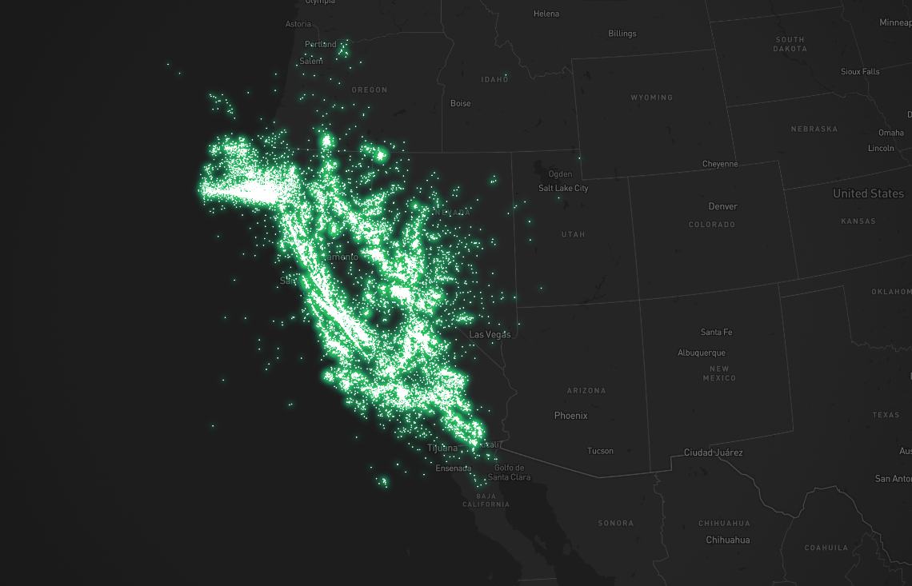

# mapbox-glowworm
适用于mapbox-gl的萤火虫打点效果

效果如下：


在线体验demo(请配置自己的mapbox token): [open in codesandbox](https://codesandbox.io/p/github/songtang0/mapbox-glowworm-example/main?layout=%257B%2522sidebarPanel%2522%253A%2522EXPLORER%2522%252C%2522rootPanelGroup%2522%253A%257B%2522direction%2522%253A%2522horizontal%2522%252C%2522contentType%2522%253A%2522UNKNOWN%2522%252C%2522type%2522%253A%2522PANEL_GROUP%2522%252C%2522id%2522%253A%2522ROOT_LAYOUT%2522%252C%2522panels%2522%253A%255B%257B%2522type%2522%253A%2522PANEL_GROUP%2522%252C%2522contentType%2522%253A%2522UNKNOWN%2522%252C%2522direction%2522%253A%2522vertical%2522%252C%2522id%2522%253A%2522cllkcsbe3000h3b6bdkulyi3k%2522%252C%2522sizes%2522%253A%255B70%252C30%255D%252C%2522panels%2522%253A%255B%257B%2522type%2522%253A%2522PANEL_GROUP%2522%252C%2522contentType%2522%253A%2522EDITOR%2522%252C%2522direction%2522%253A%2522horizontal%2522%252C%2522id%2522%253A%2522EDITOR%2522%252C%2522panels%2522%253A%255B%257B%2522type%2522%253A%2522PANEL%2522%252C%2522contentType%2522%253A%2522EDITOR%2522%252C%2522id%2522%253A%2522cllkcsbe3000c3b6bep59czxd%2522%257D%255D%252C%2522sizes%2522%253A%255B100%255D%257D%252C%257B%2522type%2522%253A%2522PANEL_GROUP%2522%252C%2522contentType%2522%253A%2522SHELLS%2522%252C%2522direction%2522%253A%2522horizontal%2522%252C%2522id%2522%253A%2522SHELLS%2522%252C%2522panels%2522%253A%255B%257B%2522type%2522%253A%2522PANEL%2522%252C%2522contentType%2522%253A%2522SHELLS%2522%252C%2522id%2522%253A%2522cllkcsbe3000g3b6bb7saiyrc%2522%257D%255D%252C%2522sizes%2522%253A%255B100%255D%257D%255D%257D%252C%257B%2522type%2522%253A%2522PANEL_GROUP%2522%252C%2522contentType%2522%253A%2522DEVTOOLS%2522%252C%2522direction%2522%253A%2522vertical%2522%252C%2522id%2522%253A%2522DEVTOOLS%2522%252C%2522panels%2522%253A%255B%257B%2522type%2522%253A%2522PANEL%2522%252C%2522contentType%2522%253A%2522DEVTOOLS%2522%252C%2522id%2522%253A%2522cllkcsbe3000e3b6b9qg247cd%2522%257D%255D%252C%2522sizes%2522%253A%255B100%255D%257D%255D%252C%2522sizes%2522%253A%255B50%252C50%255D%257D%252C%2522tabbedPanels%2522%253A%257B%2522cllkcsbe3000c3b6bep59czxd%2522%253A%257B%2522id%2522%253A%2522cllkcsbe3000c3b6bep59czxd%2522%252C%2522activeTabId%2522%253A%2522cllkcsbe2000b3b6bi4b5bkyc%2522%252C%2522tabs%2522%253A%255B%257B%2522id%2522%253A%2522cllkcsbe2000b3b6bi4b5bkyc%2522%252C%2522mode%2522%253A%2522permanent%2522%252C%2522type%2522%253A%2522FILE%2522%252C%2522filepath%2522%253A%2522%252FREADME.md%2522%252C%2522state%2522%253A%2522IDLE%2522%257D%252C%257B%2522type%2522%253A%2522FILE%2522%252C%2522filepath%2522%253A%2522%252Fsrc%252FApp.vue%2522%252C%2522id%2522%253A%2522cllkcsvxw014v3b6bjx04zcd9%2522%252C%2522mode%2522%253A%2522permanent%2522%252C%2522state%2522%253A%2522IDLE%2522%257D%255D%257D%252C%2522cllkcsbe3000e3b6b9qg247cd%2522%253A%257B%2522id%2522%253A%2522cllkcsbe3000e3b6b9qg247cd%2522%252C%2522activeTabId%2522%253A%2522cllkcsksx00y63b6bvdm3gtdg%2522%252C%2522tabs%2522%253A%255B%257B%2522type%2522%253A%2522TASK_PORT%2522%252C%2522taskId%2522%253A%2522dev%2522%252C%2522port%2522%253A5173%252C%2522id%2522%253A%2522cllkcsksx00y63b6bvdm3gtdg%2522%252C%2522mode%2522%253A%2522permanent%2522%252C%2522path%2522%253A%2522%252F%2522%257D%255D%257D%252C%2522cllkcsbe3000g3b6bb7saiyrc%2522%253A%257B%2522id%2522%253A%2522cllkcsbe3000g3b6bb7saiyrc%2522%252C%2522activeTabId%2522%253A%2522cllkcshyu00ma3b6bgtnj7stn%2522%252C%2522tabs%2522%253A%255B%257B%2522id%2522%253A%2522cllkcsbe3000f3b6bd5dy8jim%2522%252C%2522mode%2522%253A%2522permanent%2522%252C%2522type%2522%253A%2522TERMINAL%2522%252C%2522shellId%2522%253A%2522cllkcsblq000wd8fgczlxe463%2522%257D%252C%257B%2522type%2522%253A%2522TASK_LOG%2522%252C%2522taskId%2522%253A%2522dev%2522%252C%2522id%2522%253A%2522cllkcshyu00ma3b6bgtnj7stn%2522%252C%2522mode%2522%253A%2522permanent%2522%257D%255D%257D%257D%252C%2522showDevtools%2522%253Atrue%252C%2522showShells%2522%253Atrue%252C%2522showSidebar%2522%253Atrue%252C%2522sidebarPanelSize%2522%253A15%257D)
# example
1. 初始化一个GlowwormMap实例并且添加一个萤火虫发光图层
```typescript
import {GlowwormMap} from 'mapbox-glowworm';

// ...
const map = new mapboxgl.Map({
  ...
});
// ...
map.on('load', () => {
  const mapData = [
    {
      gps: [114.184921, 22.350617],
      level: '', // 点类型 自定义，后序点的颜色根据这个字段匹配
    }
  ]
  const glowworm = new GlowwormMap(map); // 传入mapbox实例
  glowworm.addGlowwormLayer(mapData, {
    glowwormLayerName: 'glowwormLayerName',
  });
});
```
# addGlowwormLayer方法配置项以及参数说明
## 1. params data
`data: MapDotBack[]`
## 2. params options
`options: GlowwormMapOptions`


| GlowwormMapOptions     | type                                  | required | description                                                                                    |
|------------------------|---------------------------------------|----------|------------------------------------------------------------------------------------------------|
| mapColorList           | string[] or number[]                  | false    | 普通环形打点颜色列表                                                                                     |
| glowwormInnerColorList | string[] or number[]                  | false    | 萤火虫打点内环颜色列表                                                                                    |
| glowwormOutColorList   | string[] or number[]                  | false    | 萤火虫打点外环颜色列表，内环比外环颜色应当更深一点                                                                      |
| colorKey               | string                                | false    | 匹配颜色的自定义字段，不传则默认为keyStr                                                                        |
| dotSize                | number[]                              | false    | dotSize示例：[14.1, 3, 32, 9]，根据不同zoom匹配不同的大小，circleRadius和dotSize只能二选一，传入circleRadius后则dotSize失效 |
| circleBlur             | number or StyleFunction or Expression | false    |                                                                                                |
| circleColor            | string or StyleFunction or Expression | false    |                                                                                                |
| circleRadius           | number or StyleFunction or Expression | false    |                                                                                                |
| circleStrokeWidth      | number or StyleFunction or Expression | false    |                                                                                                |
| circleStrokeColor      | string or StyleFunction or Expression | false    |                                                                                                |
| circleOpacity          | number                                | false    |                                                                                                |


# 全局types
```typescript
interface MapDotBack {
  gps: number[];
  level?: string;
}
interface MapOptions {
  mapColorList?: (number | string) []; // 普通打点颜色列表
  glowwormInnerColorList?: (number | string) []; // 萤火虫打点内环颜色
  glowwormOutColorList?: (number | string) []; // 萤火虫打点外环颜色
  colorKey?: string; // 匹配颜色的自定义字段
  dotSize?: number[];
  circleBlur?: number | StyleFunction | Expression;
  circleColor?: string | StyleFunction | Expression;
  circleRadius?: number | StyleFunction | Expression;
  circleStrokeWidth?: number | StyleFunction | Expression;
  circleStrokeColor?: string | StyleFunction | Expression;
  circleOpacity?: number;
}
```
